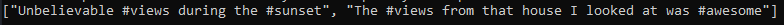
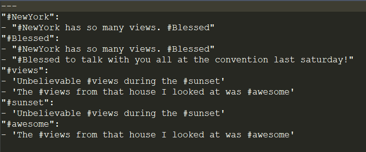

# RubyHashLookup
Look up messages stored in a database with a specific hashtag.

This is one part of a full-stack Twitter clone that I want to develop for practice.

I plan on developing Twooter (my Twitter clone) in Ruby on Rails.

I have devised a system to allow efficient Hashtag lookup using a Ruby Hash to store arrays of messages containing that hashtag.
When a twoot is posted it will automatically have its message parsed for any hashtags. If hashtags are present, they are spliced and hashed with the message being appended
to a global twoot database.

The Ruby Hash is serialized using YAML which allows for saving and opening of the hash to keep a running, consisten tally of all messages containing
a specific hash.

**EXAMPLE**

say our Twoot database has these twoots:
1) #NewYork has so many views. #Blessed-steph
2) #Blessed to talk with you all at the convention last saturday!-jessica
3) Unbelievable #views during the #sunset-brian
4) The #views from that house I looked at was #awesome-jim

we can then use a hashtag lookup function for "#views" to find these twoots containing that hashtag:

Here is our Twoot Database YAMl for the given example:

